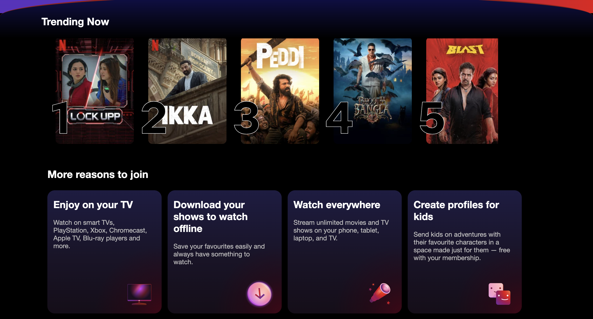
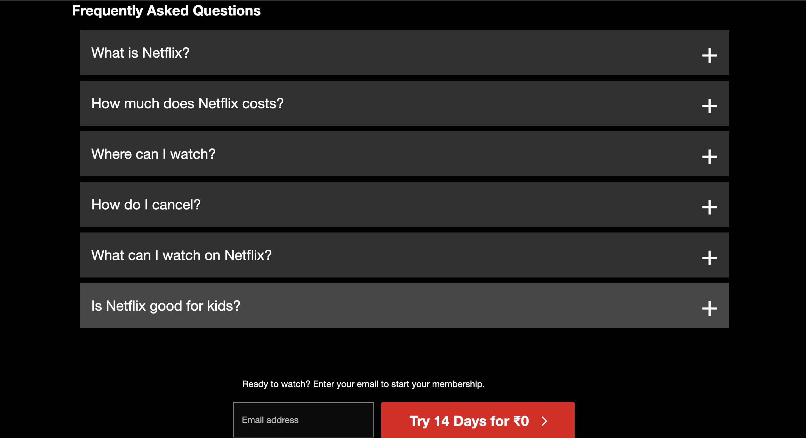
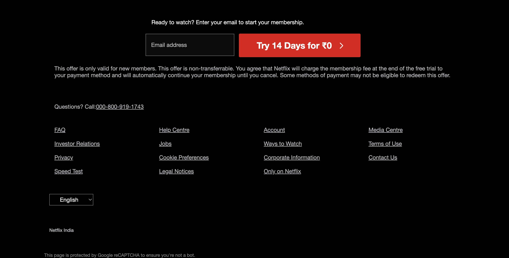
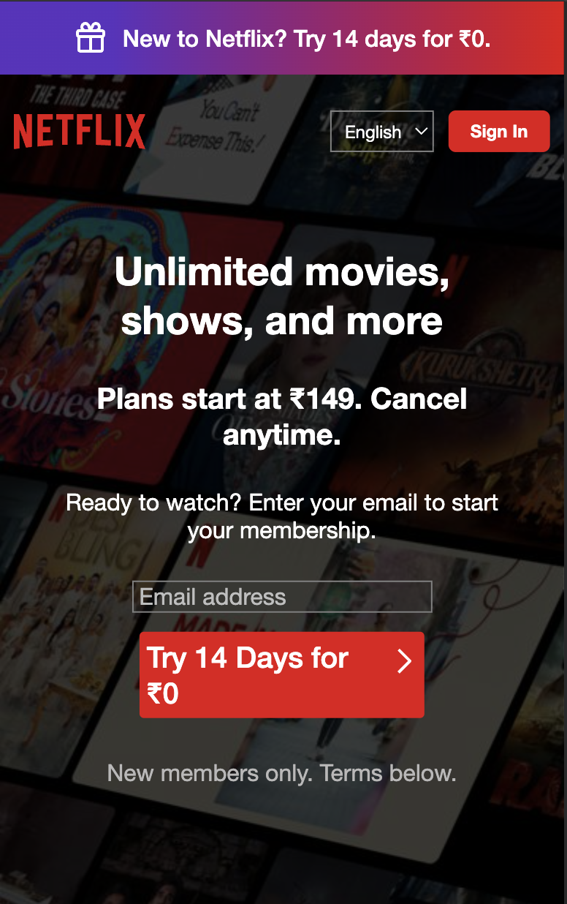
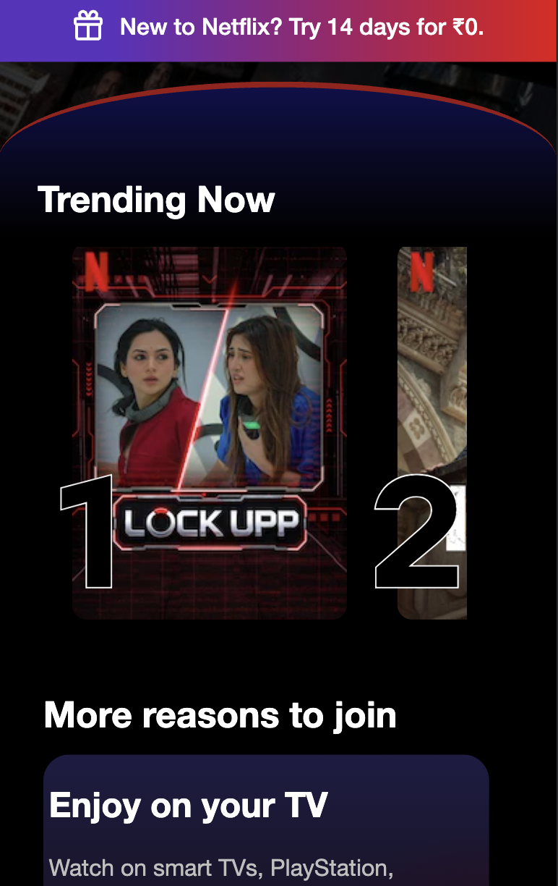
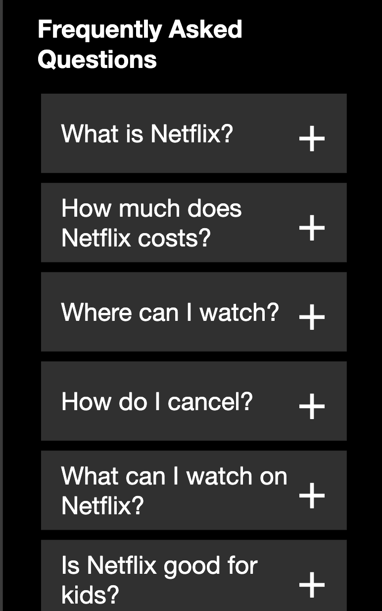
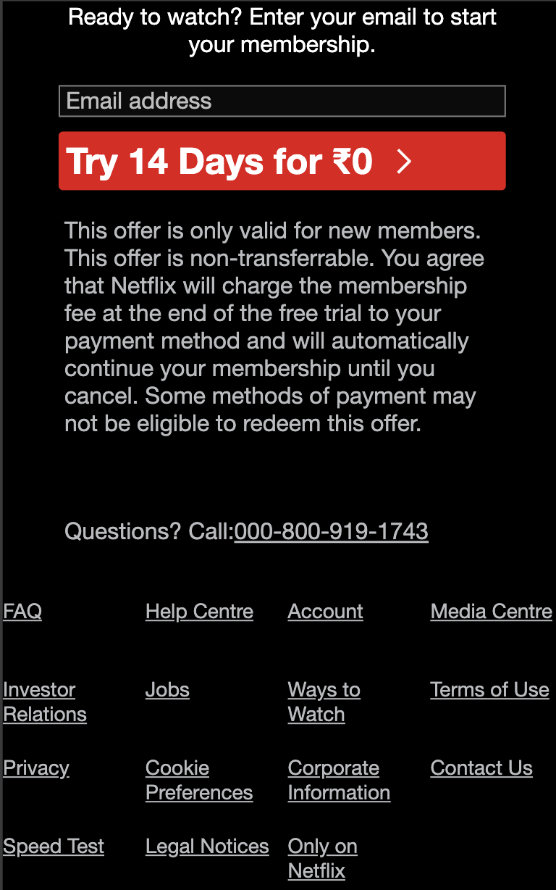

# Netflix Clone 🎬

I built this project to practice HTML and CSS by recreating the Netflix landing page. The main goal was to improve my understanding of layouts, responsiveness, and writing clean front-end code.

## Live Demo

👉 Add your GitHub Pages link here

## Features

- Responsive design
- Netflix-inspired interface
- Built using only HTML and CSS
- Clean and organized code

## Tech Stack

- HTML5
- CSS3

## Preview

### 💻 Desktop

| Home | Features |
|------|----------|
|  |  |

| FAQ | Footer |
|-----|--------|
|  |  |

### 📱 Mobile

| Home | Features |
|------|----------|
|  |  |

| FAQ | Footer |
|-----|--------|
|  |  |

## Running the Project

Clone the repository and open `index.html` in your browser.

## What I Learn

Building this project helped me get more comfortable with:

- Structuring web pages with HTML
- Creating responsive layouts using CSS
- Working with Flexbox
- Organizing project files
- Paying attention to UI details

## Future Improvements

- Add JavaScript for interactive features
- Improve animations
- Build the remaining Netflix pages

## Note

This project is for learning purposes only. It is inspired by Netflix and is not affiliated with or endorsed by Netflix.
